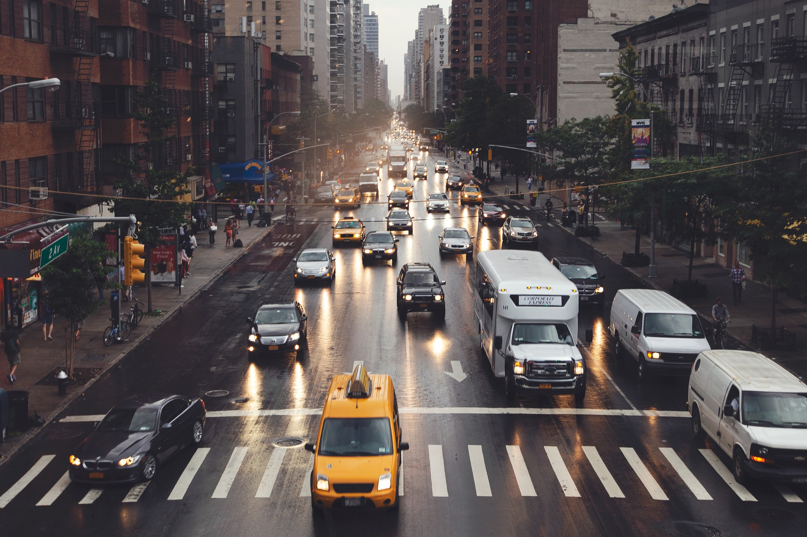
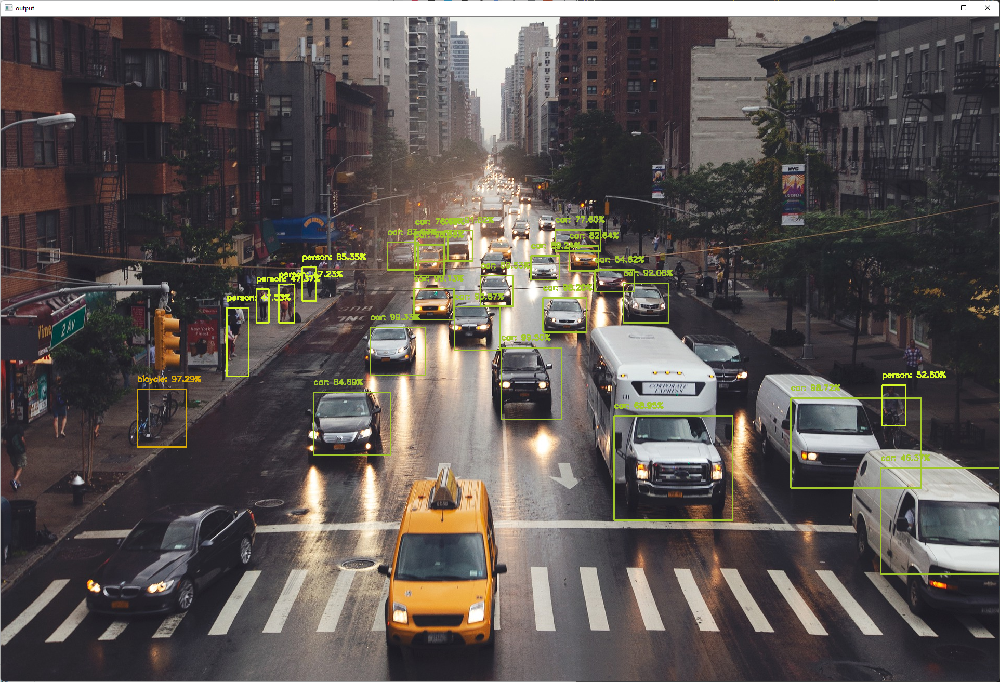

# MobileNet_SSD_openCV

## Explanation
The MobileNetSSD model is first trained on MS-COCO dataset, then fine-tuned on VOC0712. It is a caffe model implemented from TensorFlow, achieving mAP=72.7. The caffe model and prototxt is loaded to the python program. And the path of image and confidence rate are packaged as argument parse as settings to predict the objects. Pretrained prediction of objects is classified to 20 categories including background. 

Read the image information, then put it through blob function. Blob input is passed to the neurol network. Detection result is immediately generated from the lightweight model. The model contains deep convolution layers, batch normalization layers, and rectified layer. 

The objects detected have confidence over the argument defined will count into valid prediction. They will be printed on the console and marked with bounding boxes on the image. The printed message includes the object classification and confidence rate. The color of bounding boxes is different from objects, the label of the object is placed on the top left of boxes. 

Modification of image quality that feeds to the blob will significantly influence the mean average precision of image. Parameters available for tuning around on the program are confidence rate and input of blobfromimage function. The scalefactor of function is almost fixed, minor variation will make the prediction malfunctioned. Changing mean values of scalar subtract from color channels can improve the prediction result at a degree. 

## Result
According to the objects detection results that are generated from different parameters setting, the cars on the bottom of the image is failed to the detection, they have confidence around 0.4 to classified as bottle. The streetlight has confidence around 0.35 predicted as areophane. 

 
#### image of traffic road for object detection

 
#### image with detected objects in bounding boxes 

### Log

```
Console printing: 
[INFO] loading model... 
[INFO] computing object detections... 
 
[INFO] bicycle: 97.29% 
[INFO] car: 99.50% 
[INFO] car: 99.33% 
[INFO] car: 99.13% 
[INFO] car: 98.72% 
[INFO] car: 98.20% 
[INFO] car: 96.66% 
[INFO] car: 95.87% 
[INFO] car: 92.08% 
[INFO] car: 91.82% 
[INFO] car: 89.21% 
[INFO] car: 84.69% 
[INFO] car: 83.67% 
[INFO] car: 82.64% 
[INFO] car: 77.60% 
[INFO] car: 76.69% 
[INFO] car: 69.53% 
[INFO] car: 68.95% 
[INFO] car: 54.62% 
[INFO] car: 46.37% 
[INFO] person: 65.35% 
[INFO] person: 52.60% 
[INFO] person: 47.53% 
[INFO] person: 47.37% 
[INFO] person: 47.23% 
```

## Reference
- Professor Ehat Ercanli provides the tutorial material and machine learning topic\
https://ecs.syracuse.edu/faculty-staff/ehat-ercanli